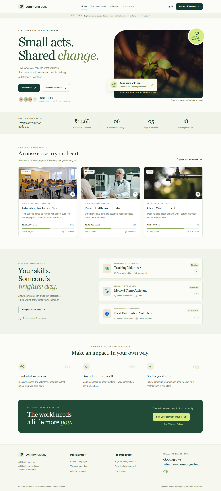
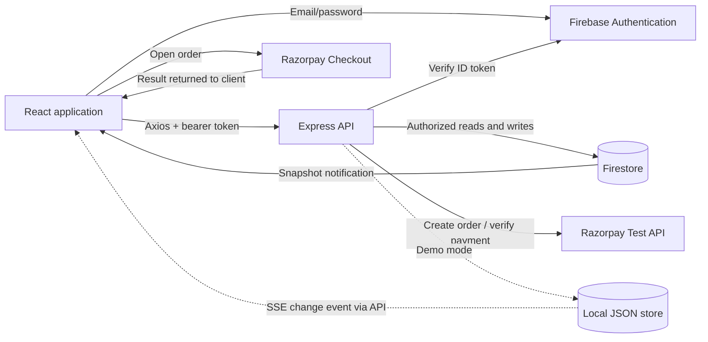
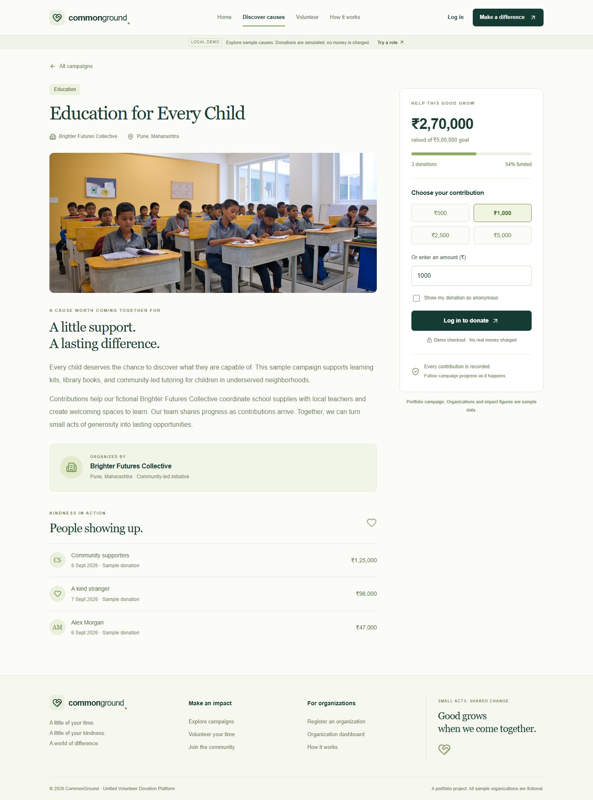
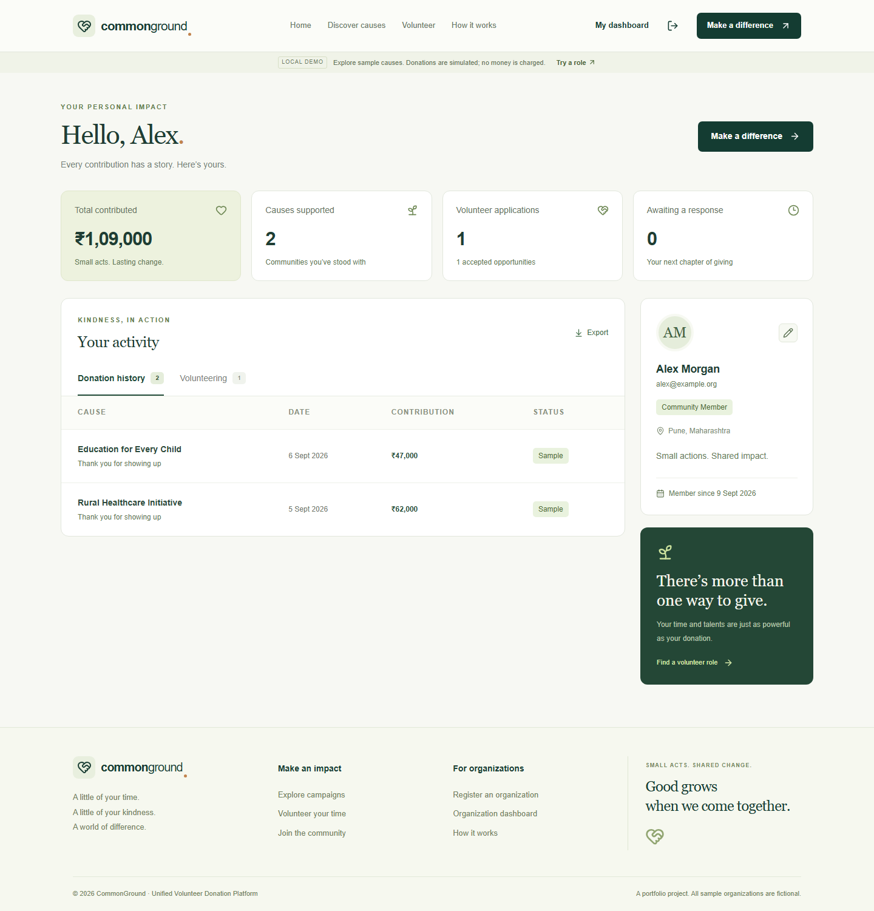
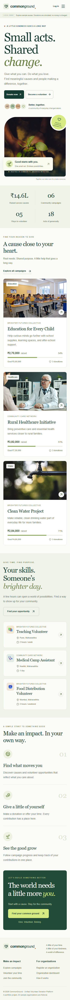

# Unified Volunteer Donation Platform

### CommonGround — small actions, shared impact.

A full-stack donation and volunteering application built with React, Express, Firebase, and Razorpay Test Mode. CommonGround brings campaign discovery, donation tracking, volunteer applications, and organization management into one responsive interface.

The project includes a working local demo that needs no external credentials, plus separate Firebase Authentication, Firestore, and Razorpay integration paths. It is designed as a maintainable portfolio project. The organizations, campaign activity, and initial donation totals are fictional sample data.



## Features

| Area                   | Functionality                                                                                                                |
| ---------------------- | ---------------------------------------------------------------------------------------------------------------------------- |
| Campaign discovery     | Search and category filters, campaign details, organization information, funding targets, progress, and recent contributions |
| Donations              | Amount selection, anonymous public attribution, server-created orders, payment verification, and donation history            |
| Volunteering           | Searchable opportunities, role details, applications, and application status tracking                                        |
| Authentication         | Registration, login, logout, protected pages, and Firebase email/password authentication when configured                     |
| Donor dashboard        | Profile, donation totals, supported campaigns, and volunteer application history                                             |
| Organization dashboard | Create and edit owned campaigns, publish opportunities, review applications, and view campaign statistics                    |
| Admin dashboard        | Platform totals, recent activity, user roles, account status, and basic campaign/opportunity management                      |
| Live updates           | Firestore snapshot listeners in Firebase mode; server-sent change notifications in the local demo                            |
| Interface              | Responsive layouts, accessible form labels, loading and empty states, Lucide icons, and locally served campaign photographs  |

Six sample causes are included: Education for Every Child, Rural Healthcare Initiative, Clean Water Project, Disaster Relief Fund, Feed a Family, and Green City Plantation Drive. Five sample volunteer roles cover teaching, health camp support, food distribution, environmental cleanup, and fundraising.

## Run locally

Use **Node.js 22.12 or newer** and npm. Start both processes from the repository root in separate terminals.

**Backend**

```bash
cd server
npm install
npm run dev
```

**Frontend**

```bash
cd client
npm install
npm run dev
```

Open [http://localhost:5173](http://localhost:5173). The API runs at [http://localhost:5000/api](http://localhost:5000/api), with a health check at [/api/health](http://localhost:5000/api/health). Both processes bind to the local machine by default.

No `.env` files are required for this first run. On the login page, use a demo role to explore the donor, organization, or admin experience. You can also register a local donor or organization account with an email and password. Demo role buttons use sample accounts without shared passwords.

### Optional single-command startup

Install the root development tools and the two application packages once:

```bash
npm install
npm run install:all
npm run dev
```

The root `dev` script starts the same backend and frontend processes using Concurrently.

### Demo persistence

The demo creates `server/data/demo.json` on first startup. Donations, profiles, and applications persist across restarts. The directory is ignored by Git. To reset the demo, stop the backend, back up or remove that file, and restart it; the sample dataset will be recreated.

Unless `DEMO_JWT_SECRET` is configured, each backend restart generates a new signing secret, so sign in again after restarting. Demo mode rejects a production environment or a non-loopback host.

## Demo mode and connected mode

| Behavior          | Local demo                                      | Firebase + Razorpay Test Mode                           |
| ----------------- | ----------------------------------------------- | ------------------------------------------------------- |
| Client setting    | `VITE_APP_MODE=demo`                            | `VITE_APP_MODE=firebase`                                |
| Server setting    | `APP_MODE=demo`                                 | `APP_MODE=firebase`                                     |
| Identity          | Local accounts and expiring demo JWTs           | Firebase email/password accounts and verified ID tokens |
| Storage           | Local JSON file                                 | Firestore                                               |
| Live updates      | SSE invalidations, followed by scoped API reads | Firestore listeners, followed by scoped API reads       |
| Payment           | Explicitly simulated local donation             | Razorpay Standard Checkout using test API keys          |
| External accounts | None                                            | Firebase project and Razorpay account                   |

Firebase and Razorpay require your own configuration. Their external services cannot be verified without valid credentials; successful demo flows do not establish that a connected Firebase project or Razorpay account is configured correctly. Live payment keys are intentionally rejected. No real money is collected in either supported payment mode.

## Tech stack

| Layer              | Technology                                                                  |
| ------------------ | --------------------------------------------------------------------------- |
| Client             | React 19, Vite 7, React Router, Axios                                       |
| UI                 | Custom responsive CSS, Lucide React                                         |
| API                | Node.js, Express 5, Zod                                                     |
| Identity and data  | Firebase Authentication, Firebase Admin SDK, Firestore                      |
| Payments           | Razorpay Standard Checkout and Node SDK, Test Mode only                     |
| Security           | Helmet, CORS allowlist, Express Rate Limit, server-side authorization       |
| Local demo         | JSON persistence, scrypt password hashing, JWT sessions, Server-Sent Events |
| Verification tools | Node test runner, Supertest, Playwright                                     |

## Architecture



The browser renders pages and requests application data through Express. The API owns validation, role checks, ownership checks, and donation writes. Live listeners trigger a fresh API read so the same response shaping and authorization rules apply to initial loading and subsequent updates. [Architecture details](docs/ARCHITECTURE.md) describe the data model, payment flow, and tradeoffs.

## Project structure

```text
unified-volunteer-donation-platform/
├── client/
│   ├── public/images/         # Local campaign photos and attribution
│   ├── src/
│   │   ├── assets/
│   │   ├── components/        # Shared controls and cards
│   │   ├── pages/             # Public pages and role dashboards
│   │   ├── layouts/           # Shared navigation and footer
│   │   ├── context/           # Authentication state
│   │   ├── hooks/             # API data and live updates
│   │   ├── services/          # Axios client
│   │   ├── firebase/          # Firebase browser configuration
│   │   └── utils/             # Formatting helpers
│   └── .env.example
├── server/
│   ├── config/               # Validated environment and Firebase setup
│   ├── controllers/
│   ├── middleware/
│   ├── routes/
│   ├── services/             # Storage, authentication, payments, seed data
│   ├── utils/
│   ├── scripts/              # Seed and administrator setup
│   ├── tests/
│   └── .env.example
├── docs/ARCHITECTURE.md
├── screenshots/
├── firebase.json
├── firestore.rules
├── firestore.indexes.json
├── .gitignore
└── README.md
```

## Environment variables

Copy `client/.env.example` to `client/.env` and `server/.env.example` to `server/.env` when changing configuration. Restart the corresponding process after editing its environment. The two app modes must match.

### Frontend: `client/.env`

All variables beginning with `VITE_` are bundled into browser code. Put only public configuration in this file.

| Variable                            | Purpose                        | Default / requirement               |
| ----------------------------------- | ------------------------------ | ----------------------------------- |
| `VITE_APP_MODE`                     | Select local demo or Firebase  | `demo`                              |
| `VITE_API_URL`                      | Express API base URL           | `http://localhost:5000/api`         |
| `VITE_FIREBASE_API_KEY`             | Firebase web app API key       | Required in Firebase mode           |
| `VITE_FIREBASE_AUTH_DOMAIN`         | Firebase authentication domain | Required in Firebase mode           |
| `VITE_FIREBASE_PROJECT_ID`          | Firebase project ID            | Required in Firebase mode           |
| `VITE_FIREBASE_APP_ID`              | Firebase web app ID            | Required in Firebase mode           |
| `VITE_FIREBASE_STORAGE_BUCKET`      | Firebase web config value      | Copy from the web app configuration |
| `VITE_FIREBASE_MESSAGING_SENDER_ID` | Firebase web config value      | Copy from the web app configuration |

The Firebase web configuration identifies a project; access is enforced by authentication, security rules, and the API. Never put a Firebase Admin private key or Razorpay secret into a `VITE_` variable.

### Backend: `server/.env`

| Variable                        | Purpose                                        | Default / requirement                                                             |
| ------------------------------- | ---------------------------------------------- | --------------------------------------------------------------------------------- |
| `APP_MODE`                      | `demo` or `firebase`                           | `demo`                                                                            |
| `NODE_ENV`                      | Runtime environment                            | `development` in the example; demo rejects `production`                           |
| `PORT`                          | API port                                       | `5000`                                                                            |
| `HOST`                          | Network binding                                | `127.0.0.1`; demo requires loopback                                               |
| `CLIENT_ORIGIN`                 | Exact allowed browser origins, comma separated | `http://localhost:5173,http://127.0.0.1:5173`; no trailing slash                  |
| `PAYMENT_MODE`                  | `demo` or `razorpay-test`                      | Defaults to demo locally and razorpay-test with Firebase; explicit demo supported |
| `FIREBASE_SERVICE_ACCOUNT_PATH` | Path to a private service account JSON file    | Firebase option A; keep outside the repository                                    |
| `FIREBASE_PROJECT_ID`           | Admin credential project ID                    | Firebase option B, with the next two values                                       |
| `FIREBASE_CLIENT_EMAIL`         | Admin service account email                    | Firebase option B                                                                 |
| `FIREBASE_PRIVATE_KEY`          | Admin service account private key              | Firebase option B; escaped `\n` is supported                                      |
| `RAZORPAY_KEY_ID`               | Razorpay test key ID                           | Required for `razorpay-test`; starts with `rzp_test_`                             |
| `RAZORPAY_KEY_SECRET`           | Razorpay signing/API secret                    | Required for `razorpay-test`; server only                                         |
| `DEMO_JWT_SECRET`               | Optional stable demo signing secret            | At least 32 characters; otherwise generated on startup                            |

Firebase mode accepts either the service account path or all three individual credential values. The examples contain no working credentials, and `.env` files and common service-account filenames are ignored by Git.

## Firebase setup

1. Create a Firebase project and register a web app. Copy its web configuration into `client/.env`, setting `VITE_APP_MODE=firebase`.
2. Enable the **Email/Password** sign-in provider in Firebase Authentication. Review the Authentication settings and ensure `localhost` is an authorized domain for local development. See [Firebase password authentication](https://firebase.google.com/docs/auth/web/password-auth).
3. Create a Cloud Firestore database for the same project. Use the repository's rules rather than leaving the database open in test mode.
4. Generate a service account for the project, keep its JSON outside this repository, and set `FIREBASE_SERVICE_ACCOUNT_PATH` in `server/.env`. Alternatively, use the three individual Admin credential values. Set `APP_MODE=firebase`. See [Firebase Admin setup](https://firebase.google.com/docs/admin/setup).
5. For local development without Razorpay, set `PAYMENT_MODE=demo` in `server/.env`. Authentication and data still use Firebase; donations are simulated and no money is charged. This mode requires loopback hosting and is forbidden in production. To enable Razorpay later, configure test keys below and set `PAYMENT_MODE=razorpay-test`.
6. Apply the repository's Firestore rules and index configuration. From the repository root, using the [Firebase CLI](https://firebase.google.com/docs/cli):

```bash
npx firebase-tools login
npx firebase-tools deploy --only firestore:rules,firestore:indexes --project YOUR_FIREBASE_PROJECT_ID
```

For rules only, alternatively run `npm run deploy:rules` from `server/` with the configured Admin service account.

The command writes to the selected Firebase project. Review `firestore.rules`, `firestore.indexes.json`, and the project ID before running it. Browser database writes are denied; application writes use the authenticated Express API and Admin SDK. Public campaign/opportunity reads and scoped private listeners are defined in the supplied rules. See [Firestore security rules](https://firebase.google.com/docs/firestore/security/get-started) and [index management](https://firebase.google.com/docs/firestore/query-data/indexing).

7. From `server/`, run `npm run seed` to add sample campaigns, opportunities, and donation records, then restart both processes. The seed is additive: existing documents are preserved. It does not create Firebase Authentication accounts or grant roles. Sample organization names are fictional; register an organization account in the app to manage its own new campaigns and opportunities. An administrator can manage the samples.
8. Register and sign in to an account through the app so its profile exists. Copy that account's UID from Firebase Authentication, then run the following in `server/` using your private Admin credentials. Sign out and sign in again afterward.

```bash
npm run make-admin -- FIREBASE_USER_UID
```

The command grants that existing account the application administrator role. It accepts a Firebase UID, not an email address. Public registration cannot create an administrator.

## Razorpay Test Mode setup

Create a Razorpay account, switch its dashboard to **Test Mode**, and generate test API keys. Add the key ID and secret to `server/.env` and set `PAYMENT_MODE=razorpay-test`. The backend requires an `rzp_test_` key ID. It returns only the public key ID and order details to the browser. See [Razorpay Standard Checkout prerequisites](https://razorpay.com/docs/payments/payment-gateway/web-integration/standard/).

Restart the backend, sign in, open a campaign, choose an amount, and continue to Razorpay Checkout. Use the current [Razorpay test payment details](https://razorpay.com/docs/payments/payments/test-card-details/?preferred-country=IN). Enable automatic payment capture in your Test Mode configuration so a completed checkout can be verified as captured. You can also test this payment integration with `APP_MODE=demo`; authentication and data then stay local while checkout uses Razorpay Test Mode.

The client posts the checkout result to the API. The server validates its stored order, verifies the HMAC signature, and fetches the payment from Razorpay. It requires the matching order, amount, currency, and a captured payment before recording a donation and updating campaign totals. Repeated verification of the same payment returns the existing donation without adding funds twice. The protocol follows [Razorpay's server order and signature workflow](https://razorpay.com/docs/payments/payment-gateway/web-integration/standard/integration-steps/).

Test successful payments, cancellation, failure, and retry behavior with your own credentials. This project does not implement live payments, refunds, webhooks, settlement reconciliation, recurring donations, or tax receipts.

## Security boundaries

- Firebase ID tokens are verified by the backend; privileged actions also require an enabled application profile and an allowed role.
- Organizations can modify their own resources. Admin assignment is excluded from public registration.
- Payment order creation and verification run on the server; secret keys stay in backend configuration.
- Donation records and funding totals are written together through a storage transaction.
- Zod validates request input. Helmet, JSON body limits, rate limits, and an exact CORS allowlist are applied by the API.
- Public recent-donation responses omit private account identifiers and emails. Anonymous contributions use anonymous public attribution.
- Firestore browser writes are denied. Private listener reads are restricted by owner, organization, or administrator role.
- Local demo tokens expire, stored passwords use salted scrypt hashes, and demo shortcuts are unavailable in Firebase mode.

These controls support the portfolio workflows; they are not a claim of an independent security audit or production certification.

## Build and verification

Build the frontend from `client/`:

```bash
npm run build
```

Run backend tests from `server/`:

```bash
npm test
```

Root convenience commands are `npm run build`, `npm test`, and `npm run test:e2e`. Install the root dependencies and Playwright's Chromium browser before the browser suite:

```bash
npm install
npx playwright install chromium
npm run test:e2e
```

Automated local checks and mocked payment verification do not replace a credentialed Firebase/Razorpay integration test. For a manual walkthrough, exercise all three roles, create a campaign and opportunity, make a demo donation, apply for an opportunity, change its application status, and confirm that another open page updates without a manual refresh.

Local verification: **15 backend tests and 7 browser tests passed**, and the production frontend build completed successfully. See the [verification record](docs/VERIFICATION.md) for scope and external-service limitations.

The browser suite uses an isolated in-memory API on port 5100 and frontend on port 5174. It leaves your saved local demo unchanged. Use `npm run format:check` to check source formatting or `npm run format` to format it.

## Screenshots

| Campaign details                                      | Donor dashboard                                       |
| ----------------------------------------------------- | ----------------------------------------------------- |
|  |  |

<details>
<summary>Mobile home page</summary>



</details>

[Screenshot notes](screenshots/README.md) describe the routes and capture process. Campaign photos are bundled locally; photographer credits and source licenses are recorded in [image attribution](client/public/images/ATTRIBUTION.md).

## Portfolio description

**Unified Volunteer Donation Platform | React, Firebase, Node.js, Express.js, Razorpay**

- Developed a full-stack application unifying donation campaigns, volunteer opportunities, and organization management through role-based dashboards.
- Implemented server-created payment orders, signature verification, transaction-based donation updates, and Firestore listeners for real-time campaign and dashboard updates.
- Organized the application into reusable React components, an authenticated Express API, and interchangeable data adapters, with responsive layouts for desktop and mobile.

These bullets describe the implementation. Add measured performance, scale, or real service validation claims only after collecting that evidence in your own environment.

## License

Source code is available under the [MIT License](LICENSE). Third-party photographs retain their original [Unsplash license and credits](client/public/images/ATTRIBUTION.md).
