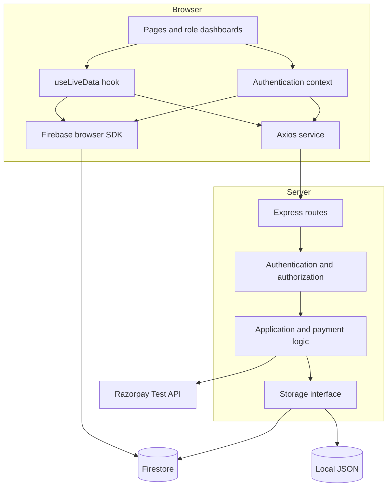
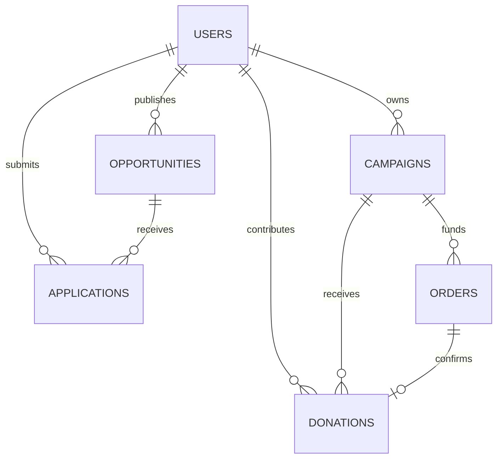
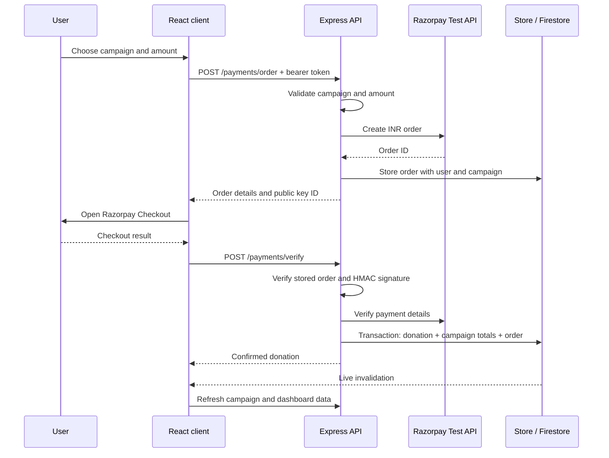

# Architecture

CommonGround is a React single-page application backed by an Express API. A small storage interface supports two configurations: a credential-free local demo and Firebase-backed application data. The architecture keeps application authorization and payment mutations on the server while using browser listeners for live updates.

## Runtime configurations

| Concern              | Demo                                                             | Firebase                                                     |
| -------------------- | ---------------------------------------------------------------- | ------------------------------------------------------------ |
| Authentication       | Local registration, salted scrypt password hashes, expiring JWTs | Firebase Authentication; Admin SDK verification of ID tokens |
| Persistence          | `server/data/demo.json`                                          | Cloud Firestore                                              |
| Transactions         | Serialized copy-on-write operations with file replacement        | Firestore transactions                                       |
| Update notifications | SSE `change` events                                              | Firestore `onSnapshot` listeners                             |
| Donation workflow    | Explicit simulation bound to a server order                      | Razorpay Test Mode verification or explicit local simulation |

Frontend and backend modes are selected independently through environment variables and must match. Backend configuration rejects unsupported modes, live Razorpay keys, non-loopback demo or simulated-payment bindings, and demo authentication or simulated payments in a production environment.

The demo is a single-process local application. Its JSON store is useful for reproducible portfolio walkthroughs; it is not a shared multi-server database.

## Components and responsibilities

- **Pages and layouts** define navigation, public discovery, details, and role-specific interfaces. Protected routing improves the UI; the API separately enforces authorization.
- **Authentication context** tracks the application profile and exposes registration, login, logout, and profile refresh. The Axios interceptor attaches the current Firebase ID token or demo session token.
- **Live-data hook** fetches canonical API responses, subscribes to relevant changes, and refreshes after notifications. It closes listeners on unmount and ignores superseded requests.
- **Express** validates inputs, verifies identity, looks up the current application role, applies ownership rules, shapes public data, and coordinates storage writes.
- **Storage adapters** expose document reads, filtered lists, writes, and transactions. Both configurations use the same campaign, application, dashboard, and payment logic.

## Data model

All model IDs are exposed as `id`. Dates use ISO strings. Campaign targets, raised totals, and donation amounts are integer INR rupees; payment-order amounts use paise. Conversion occurs on the server.

| Collection      | Main fields and purpose                                                                                  |
| --------------- | -------------------------------------------------------------------------------------------------------- |
| `users`         | `name`, `email`, `role`, `organizationName`, profile fields, `disabled`, timestamps                      |
| `campaigns`     | Title, category, text, image, location, target, raised total, donation count, organization owner, status |
| `opportunities` | Title, description, date, commitment, skills, spots, organization owner, open/closed status              |
| `donations`     | Donor and campaign IDs, display attribution, amount, payment ID, mode, timestamp                         |
| `applications`  | Applicant and opportunity IDs, organization owner, motivation, status, timestamp                         |
| `orders`        | Server-owned donation order and payment amount/context                                                   |
| `paymentClaims` | Payment identity claims used to guard duplicate payment recording                                        |
| `credentials`   | Local demo account credentials; not readable by browser clients                                          |

Campaign and donation records carry selected display fields, such as campaign title or organization name, to keep API rendering straightforward. Seeded amounts correspond to sample donation records and are explicitly fictional.

## Authentication and roles

In Firebase mode, the browser registers or signs in through Firebase Authentication. It sends the ID token to Express, which verifies it with the Admin SDK. A profile synchronization endpoint creates the application user record. Public registration accepts `user` or `organization`; administrators are assigned through privileged server tooling or an existing administrator.

The application profile is the role source of truth. API authorization reads the current profile instead of trusting a role submitted by the browser. Firestore rules consult that profile for private listeners. Disabled profiles cannot use protected API operations.

| Role         | Access                                                                                                              |
| ------------ | ------------------------------------------------------------------------------------------------------------------- |
| Visitor      | Browse public campaigns and opportunities, read public recent contributions                                         |
| User / donor | Donate, apply, manage own profile, view personal history                                                            |
| Organization | Manage owned campaigns and opportunities, review applications for owned opportunities, view organization statistics |
| Admin        | View platform statistics and perform basic user/resource management                                                 |

Organization ownership uses `organizationId`, which matches the owner's user document ID. Sample organizations in seeded data are display fixtures. Newly registered organizations manage resources they create under their own identity.

## Payment flow

The browser never sends a Razorpay secret. The server retains the order context, calculates the smallest-unit amount, and verifies the payment result. It compares the HMAC signature in constant time and fetches the payment to check the ID, order, amount, currency, `status === 'captured'`, and `captured === true`.

One storage transaction records the donation, claims the payment identity, increments the campaign total and donation count, and completes the order. A completed-order retry returns the existing donation; a conflicting payment claim is rejected. The local simulated-payment endpoint exists only when demo payments are enabled and uses the same order ownership and donation-recording path.

The implementation targets an interactive Test Mode checkout. It does not provide webhook recovery, refund handling, recurring billing, settlement reconciliation, or production accounting. If a checkout completes but the browser fails before verification reaches the API, there is no background webhook process to reconcile it; investigate the test payment before attempting another transaction.

## Real-time data flow and privacy

In Firebase mode, `useLiveData` attaches `onSnapshot` listeners to the requested collections. Public pages observe campaign/opportunity changes. Private donation and application listeners use the current user's ID or an organization's ID; administrators use broader listeners permitted by the rules. Non-admin user listeners watch only the current profile.

Snapshot events invalidate an API request. They are not used to bypass API response shaping. When a donation is recorded, the campaign changes as well, allowing a public campaign page to refresh its sanitized recent-donation list without subscribing to the private donations collection.

In demo mode, `/api/events` sends a generic `change` event after committed mutations. It includes no donation, profile, email, or application content. Clients fetch their own authorized data afterward. The stream signals that the shared sample state changed; it is not a private-data transport.

Firestore browser writes are denied. The Admin SDK operates with server credentials, so Express validation and authorization remain necessary even when Firestore rules are deployed. Rules protect browser listeners; they do not replace server authorization.

## API summary

The API base is `http://localhost:5000/api`. Successful responses contain the object or array directly. Error responses use `{ "message": "..." }` with an appropriate HTTP status. Protected operations require `Authorization: Bearer <token>`.

| Endpoint                                          | Purpose                                                                                                                      |
| ------------------------------------------------- | ---------------------------------------------------------------------------------------------------------------------------- |
| `GET /health`                                     | Runtime and payment mode                                                                                                     |
| `POST /auth/demo`                                 | Local demo role sign-in                                                                                                      |
| `POST /auth/register`, `POST /auth/login`         | Demo email/password authentication                                                                                           |
| `POST /auth/sync`                                 | Synchronize a Firebase-authenticated application profile                                                                     |
| `GET /users/me`, `PATCH /users/me`                | Read/update current profile                                                                                                  |
| `GET /campaigns`, `GET /campaigns/:id`            | Public campaign data                                                                                                         |
| `GET /campaigns/:id/donations`                    | Sanitized recent contributions                                                                                               |
| `POST /campaigns`, `PATCH /campaigns/:id`         | Authorized campaign management                                                                                               |
| `GET /opportunities`, `GET /opportunities/:id`    | Public opportunity data                                                                                                      |
| `POST /opportunities`, `PATCH /opportunities/:id` | Authorized opportunity management                                                                                            |
| `POST /applications`, `PATCH /applications/:id`   | Apply, review, or withdraw an application                                                                                    |
| `GET /dashboard`                                  | Role-scoped history, resources, statistics, and activity; `?view=personal` requests only personal donations and applications |
| `PATCH /admin/users/:id`                          | Privileged role/account status management                                                                                    |
| `POST /payments/order`                            | Create a donation order                                                                                                      |
| `POST /payments/demo`                             | Confirm a simulated local order                                                                                              |
| `POST /payments/verify`                           | Verify a Razorpay Test Mode result                                                                                           |
| `GET /events`                                     | Demo change stream                                                                                                           |

## Scope and tradeoffs

The modules make a small application easy to follow and extend. Collection lists and dashboard aggregation are intentionally simple; they do not claim benchmarked scalability. Large deployments would need pagination, measured query plans, aggregate maintenance, monitoring, and operational controls.

The repository supplies credential-free workflows for local testing and the code/configuration for connected services. External Firebase and Razorpay behavior must be validated against the developer's own project and test account. Local or mocked tests cannot certify those credentials, service rules, capture settings, or network behavior.

See the [README](../README.md) for installation, environment variables, service setup, screenshots, and verification commands.
